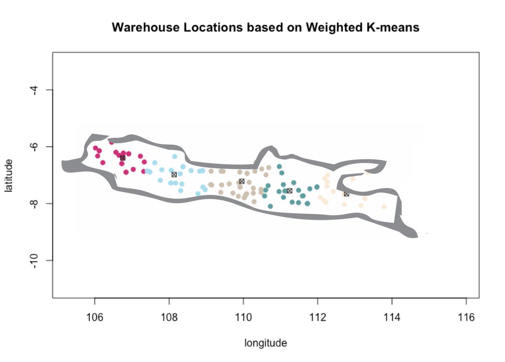

# Weighted K-means clustering implementation in R

We use weighted K-means clustering algorithm to determine warehouses' location of a specific restaurant chain that operates in Java Island. The data points are all cities in Java island. What become the weights are cities population. Moreover, the distance used is Haversine distance, as we will work with lon-lat coordinate system.

## How to navigate this repository
1. Define Haversine distance using [``haversine_dist.R``](https://github.com/pararawendy/weighted_kmeans_R/blob/master/codes/haversine_dist.R)
2. Define sum of squares error using [``SSM.R``](https://github.com/pararawendy/weighted_kmeans_R/blob/master/codes/SSM.R)
3. Define and execute weighted K-means algorithm using [``weighted_kmeans.R``](https://github.com/pararawendy/weighted_kmeans_R/blob/master/codes/weighted_kmeans.R)
4. Find the optimal K via The Elbow Method using [``elbow_method.R``](https://github.com/pararawendy/weighted_kmeans_R/blob/master/codes/elbow_method.R)
5. Plot the result using [``plotting_result.R``](https://github.com/pararawendy/weighted_kmeans_R/blob/master/codes/plotting_result.R)

## The result

